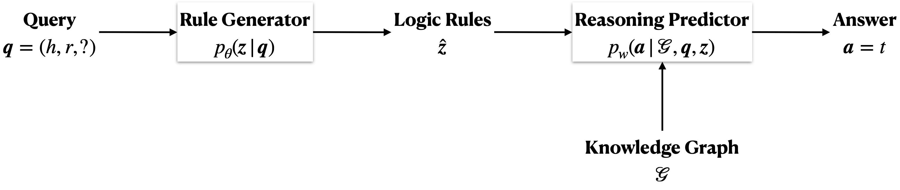
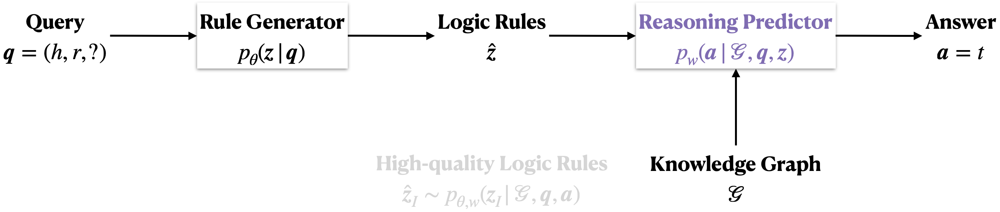
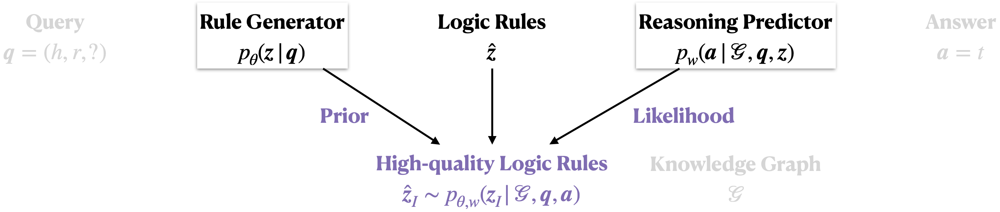
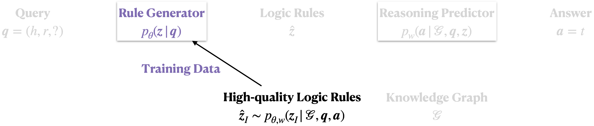

# RNNLogic

This is an implementation of the [RNNLogic](https://arxiv.org/abs/2010.04029) model for knowledge graph reasoning.

## Introduction

RNNLogic focuses on knowledge graphs, which are collections of real-world facts, with each fact represented by a (h,r,t)-triplet. As collecting facts is expensive, knowledge graphs are imcomplete, and thus predicting missing facts in a knowledge graph is an important problem with growing attention. Such a problem is known as **knowledge graph reasoning**.

RNNLogic solves knowledge graph reasoning by learning **logic rules**, which have been proved to improve the *interpretability* and *precision* of reasoning. To do that, RNNLogic employs a **rule generator** and a **reasoning predictor**. The rule generator is parameterized by a RNN, which is able to model and generate chain-like rules. The reasoning predictor follows stochastic logic programming, which uses a set of logic rules as input to predict the answers of queries. Given a query, the rule generator generates a set of logic rules, which are fed into the reasoning predictor. The rule generator further applies the logic rules to the existing knowledge graph for predicting the answer.



To optimize the reasoning predictor and the rule generator, we propose an **EM-based algorithm**. At each iteration, the algorithm starts with generating a set of logic rules, which are fed into the reasoning predictor and we further update the reasoning predictor based on the training queries and answers.



Then in the E-step, a set of high-quality logic rules are selected from all the generated logic rules according to their posterior probabilities.



Finally in the M-step, the rule generator is updated to be consistent with the high-logic logic rules identified in the E-step.



## Data
We provide four datasets for knowledge graph reasoning, and these datasets are FB15k-237, WN18RR. For FB15k-237 and WN18RR, there are standard splits for the training/validation/test sets.

## Usage

We provide a few options to run the codes:

### 1. Joint Training of Predictors and Generators

In the first option, we jointly train the predictor and the generator, and you might follow the following steps

* **Step 1: Mine logic rules**

In the first step, we mine some low-quality logic rules, which are used to pre-train the rule generator in RNNLogic to speed up training.

To do that, go to the folder `miner`, and compile the codes by running the following command:

```
g++ -O3 rnnlogic.h rnnlogic.cpp main.cpp -o rnnlogic -lpthread
```

Afterwards, run the following command to mine logic rules:

```
./rnnlogic -data-path ../data/FB15k-237 -max-length 3 -threads 40 -lr 0.01 -wd 0.0005 -temp 100 -iterations 1 -top-n 0 -top-k 0 -top-n-out 0 -output-file mined_rules.txt
```

The codes run on CPUs. Thus it is better to use a server with many CPUs and use more threads by adjusing the option `-thread`. The program will output a file called `mined_rules.txt`, and you can move the file to your dataset folder.

* **Step 2: Run RNNLogic+**

Next, we are ready to run RNNLogic. To do that, please first edit the config file in the folder `config`, and then go to folder `src`.

If you would like to use single-GPU training, please edit line 39 and line 60, and further run:

```
python run_rnnlogic.py --config ../config/FB15k-237.yaml
python run_rnnlogic.py --config ../config/wn18rr.yaml
```

If you would like to use multi-GPU training, please run:

```
python -m torch.distributed.launch --nproc_per_node=4 run_rnnlogic.py --config ../config/FB15k-237.yaml
python -m torch.distributed.launch --nproc_per_node=4 run_rnnlogic.py --config ../config/wn18rr.yaml
```

**Note** that if you would like to use RotatE embeddings to boost the link prediction results, as what RNNLogic with embedding does, you might add an argument  `entity_feature: <RotatE path>` at the line 60 of the above config files, where `<RotatE path>` is the output path of the RotatE model trained with [this repo](https://github.com/DeepGraphLearning/KnowledgeGraphEmbedding).

### 2. Training of Predictors

In the above config files, we only run RNNLogic for 10 EM iterations for illustration. In order to get better performance, it is necessary to run the model for more iterations, but this can be slow. Thus, in the second option, we provide the logic rules learned by RNNLogic in `data/FB15k-237/rnnlogic_rules.txt` and `data/wn18rr/rnnlogic_rules.txt`, and we can directly use these logic rules to train a good predictor for knowledge graph reasoning on FB15k-237 and wn18rr.

To do that, go to the folder `src`, and then you might run:

```
python -m torch.distributed.launch --nproc_per_node=4 run_predictorplus.py --config ../config/FB15k-237_predictorplus.yaml
python -m torch.distributed.launch --nproc_per_node=4 run_predictorplus.py --config ../config/wn18rr_predictorplus.yaml
```

## Citation

Please consider citing the following paper if you find our codes helpful. Thank you!
```
@inproceedings{qu2020rnnlogic,
  title={RNNLogic: Learning Logic Rules for Reasoning on Knowledge Graphs},
  author={Qu, Meng and Chen, Junkun and Xhonneux, Louis-Pascal and Bengio, Yoshua and Tang, Jian},
  booktitle={International Conference on Learning Representations},
  year={2021}
}
```